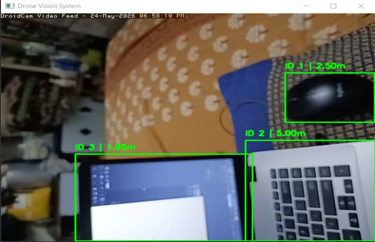
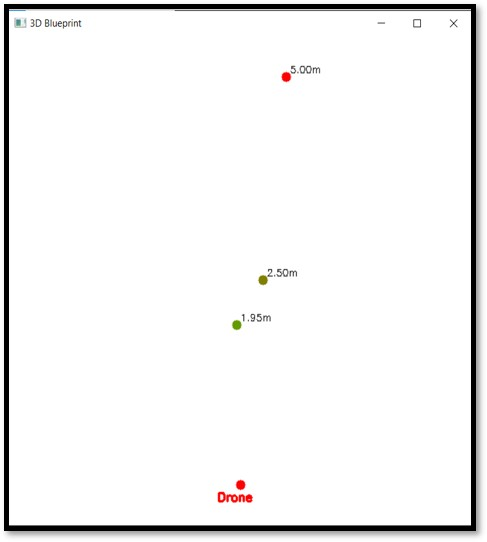
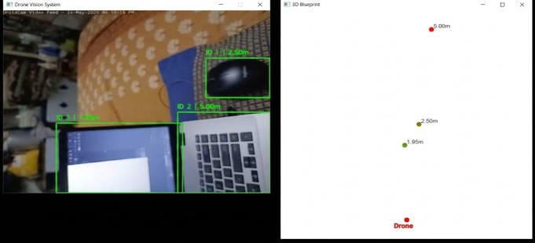

# 🚁 AI-Based Drone Vision System

An AI-powered Computer Vision system that performs **real-time object detection**, **monocular depth estimation**, and **3D spatial mapping** using a single RGB camera. The project combines YOLO object detection with MiDaS depth estimation to generate an approximate spatial representation of the surrounding environment, making it suitable for drone navigation, robotics, surveillance, and obstacle awareness applications.

---

## 📌 Features

- 🎯 Real-time object detection using YOLO
- 📏 Monocular depth estimation using MiDaS
- 🗺️ Real-time 3D blueprint (top-down spatial map)
- 📐 Approximate object-to-object distance estimation
- 📦 Duplicate detection removal using IoU filtering
- 🔄 Temporal depth smoothing for stable visualization
- 🚀 Multi-threaded video capture for reduced latency
- ⚡ Asynchronous depth estimation pipeline
- 💾 Export spatial data to JSON and Pickle
- 🔍 SAHI-ready architecture for improved small and distant object detection

---

## 🛠️ Tech Stack

- Python
- OpenCV
- PyTorch
- Ultralytics YOLO
- MiDaS
- NumPy
- SAHI (Integration Ready)

---

## 🏗️ System Architecture

Camera Input
`
      │
      ▼
      
Video Stream
`
      │
      ▼
      
YOLO Object Detection
`
      │
      ▼
      
MiDaS Depth Estimation
`
      │
      ▼
      
3D Position Calculation
`
      │
      ▼
      
Distance Estimation
`
      │
      ▼
      
3D Blueprint Visualization


## 📂 Project Structure

Drone-Vision-System/

│
├── main.py

├── config.py

├── detection.py

├── depth_estimation.py

├── geometry.py

├── blueprint.py

├── videostream.py

├── exporter.py

├── utils.py

├── sahi_detector.py

├── models/

├── outputs/

└── README.md

Place the following pretrained models in models folder before running the project:

- yolo26n.pt
- dpt_large_384.pt

Download them from their respective official sources.

## 🚀 Installation

Clone the repository

```bash
git clone https://github.com/yourusername/AI-Drone-Vision-System.git
cd AI-Drone-Vision-System
```

Install dependencies

```bash
pip install -r requirements.txt
```

Run the project

```bash
python main.py
```

---

## Camera Configuration

By default, the project uses your computer's webcam:

VIDEO_PATH = 0

To use DroidCam or an IP Webcam, replace it with your stream URL:

VIDEO_PATH = "http://<your-ip>:4747/video"

## 📊 Current Capabilities

- Detects multiple objects in real time
- Estimates approximate depth using a monocular RGB camera
- Generates a real-time 3D spatial blueprint
- Calculates approximate distances between detected objects
- Supports CPU-based execution without requiring a dedicated GPU
- Optimized for low-resource hardware through threaded processing and asynchronous inference

---

## 🔄 Future Improvements

- Full SAHI integration for enhanced small-object detection
- Object tracking with trajectory visualization
- Obstacle avoidance and collision warning system
- Dynamic occupancy grid mapping
- Real-world camera calibration for improved metric depth estimation
- SLAM integration for large-scale environment mapping

---

## ⚠️ Limitations

- Uses monocular depth estimation, which provides approximate rather than LiDAR-level metric accuracy.
- Distance estimation may vary depending on lighting conditions, camera calibration, and scene complexity.
- Performance is optimized for CPU execution but improves significantly with GPU acceleration.

---

## Project Demonstration

### Real-Time Object Detection



### 3D Blueprint



### Combined View



## 👨‍💻 Author

**Ansh Agraekar**

Artificial Intelligence | Machine Learning | Computer Vision

Feel free to connect or contribute to the project!
